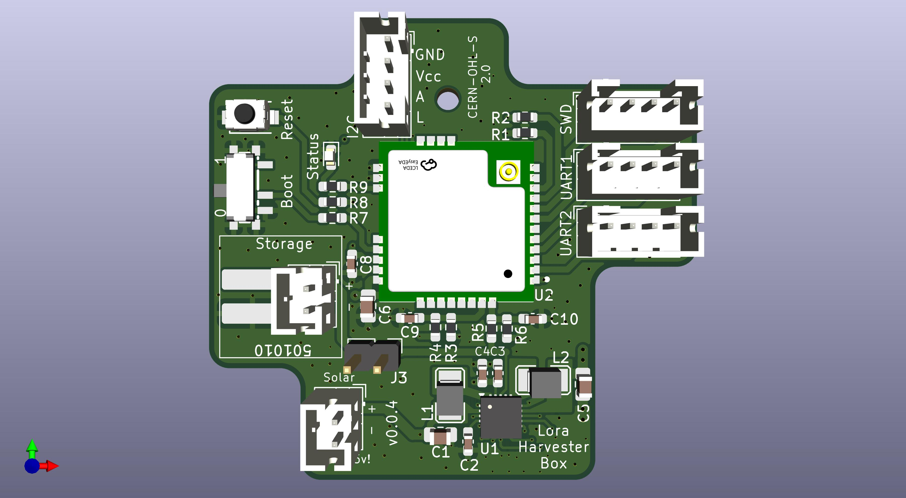

## What is this thing?

This generic LoRa base board is built around the STM32WL (RAK3172) and the TI BQ25570 energy harvester.

It is suitable for a wide range of applications, including:

- Meshtastic (repeater, limited router, sensor)
- LoRaWAN sensors
- Generic raw LoRa devices
- Or virtually any other custom project

For persistent data storage, an optional FRAM IC (Infineon FM24V10) can be mounted on the back and connected via I²C. A variety of sensors can be integrated through I²C, SPI (on the back), or USART interfaces.

The power supply design is highly flexible: alongside standard JST-PH connectors, the board also supports very small LiPo batteries (commonly used in in-ear headphones or Bluetooth headsets), which can be soldered directly. Such batteries are readily available on AliExpress (e.g. 501010). The TI BQ25570 also supports exotic sources like Supercaps, LTO, etc.

## Hardware

Will publish Resistor values as soon first PCBs arrived for testing.

WARNING: PCB not yet tested! 

## License

CERN Open Hardware Licence Version 2 - Strongly Reciprocal 

