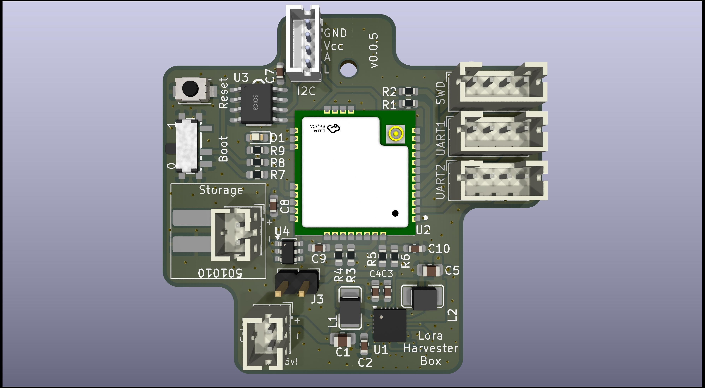
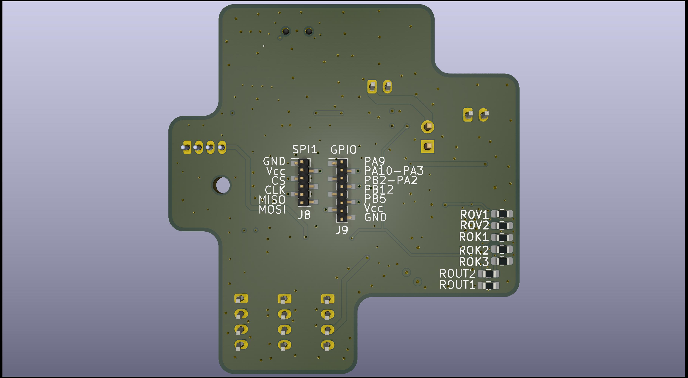

## What is this thing?

This generic LoRa base board is built around the ST STM32WLE5CC (RAK3172) and the TI BQ25570 energy harvester.

It is suitable for a wide range of applications, including:

- Meshtastic (router, sensor) or Meshcore
- LoRaWAN sensors
- Generic raw LoRa devices
- Or virtually any other custom project (ham balloon? Transmitter for tracking penguins?) that utilizes the modulation schemes (FSK, GFSK, MSK, GMSK) of the SX1262

For persistent data storage, an optional FRAM IC (Infineon FM24V10) can be mounted via I²C. A variety of sensors can be integrated through I²C, SPI (on the back), or USART interfaces.

The power supply design is highly flexible: alongside standard JST-PH connectors, the board also supports very small LiPo batteries (commonly used in in-ear headphones or Bluetooth headsets), which can be soldered directly. Such batteries are readily available on AliExpress (e.g. 501010). The TI BQ25570 also supports exotic storages like Supercaps, LTO, etc.

## Features

### Energy

- Capable of using a huge variety of energy storage devices: LiPo, LiFePo4, LTO, SIB, Supercap
- Once cold-started (600mV) the TI BQ25570 energy harvester works down to 100mV. Maximum input voltage is 5.5V. 
- Up to 110mA can be used from the application
- MPPT
- Optional load-switch to switch on/off the entire STM32/LoRa-modem based on the VBAT_OK signal

### Microcontroller

Uses the standardized RAK housing which can house a variety of platforms (ESP32, STM32, etc.) with compatible pins.

- ST STM32WLE5CC: 256Kb Flash, 64Kb RAM, 48MHz
- 2x USART
- 1x I2C
- 1x SPI (back)
- 2x ADC connected to energy source (like solar) and and energy storage (like LiPos) using voltage dividers
- Multiple break-out pins for GPIOs on the back

### LoRa

Uses the Semtech SX1262 integrated within the STM32 housing. Multiple RAK variants available for 433/470/868/915MHz.

### Data Storage

Infineon FM24V10: 1-MBit non-volatile F-RAM for storing firmware updates, messages or mesurement data

## Design Decisions

### Why did you use the TI BQ25570?

It's the only energy harvester that supports up to 110mA peak current.

I'm not overly happy with this IC as it lacks a few helpful features:

 - No I²C interface and ADC for reading voltages/currents

 - No Thermistor for switching off charging above and below specific temperatures

 - Doesn't switch off VOUT if the battery hits the lower threshold. It only signals it using a pin.

  - Rather annoying pin configuration. Layouting it doesn't make much fun.

 Honestly - It's an old thing compared to the latest generation from ST or e-peas.
  
### Why not buying a "naked" ST STM32WLE5? 

Using a SoC module from RAK brings all the HF and impedancy matching. 

Everything else leaving the housing is not really critical signal wise.

Also it's not too expensive with 6€.

### Why 3V and not 3.3V?

Improved system runtime by only loosing 1-2dB of TX power.

## Hardware

### Pin Configuration

#### ADC

| Signal | Pin | ADC Channel |
|:--------|:----|:-------------|
| Energy Storage Voltage | PB3 | A0 |
| Energy Source Voltage  | PB4 | A1 |

#### USART

| Peripheral | TX Pin | RX Pin |
|:------------|:--------|:--------|
| UART1 | PB6 | PB7 |
| UART2 | PA2 | PA3 |

#### SWD

| Signal | Pin |
|:--------|:----|
| SWDIO | PA13 |
| SWCLK | PA14 |

##### SPI

| Signal | Pin |
|:--------|:----|
| SPI1, MOSI | PA7 |
| SPI1, MISO | PA6 |
| SPI1, CLK  | PA5 |
| SPI1, NSS  | PA4 |

#### LED

| Signal | Pin |
|:--------|:----|
| LED | PA8 |

#### MISC

| Signal | Pin |
|:--------|:----|
| VBAT_OK from TI BQ25570| PA15 |

### Resistors Values

#### VOUT

| Target VOUT | R_OUT1  | R_OUT2 | R_SUM | Calculated VOUT |
|-------------|--------------|--------------|------------|-----------------|
| 1.8 V       | 8.66 MΩ       | 4.22 MΩ       | 12.88 MΩ      | ≈ 1.80V        |
| 3.0 V       | 5.10 MΩ       | 7.50 MΩ       | 12.60 MΩ     | ≈ 2.99V        |
| 3.3 V       | 4.70 MΩ       | 8.20 MΩ       | 12.90 MΩ     | ≈ 3.32V        |

#### LiPo (1-cell)

| R_OV1 | R_OV2 | R_SUM | V_OV |
|-------------|-------------|------------|-----------|
| 3.90 MΩ     | 5.10 MΩ     | 9.00       | ≈ 4.18V   |
| 3.60 MΩ     | 4.70 MΩ     | 8.30       | ≈ 4.18V   |
| 3.30 MΩ     | 4.30 MΩ     | 7.60       | ≈ 4.18V   |
| 4.30 MΩ     | 5.60 MΩ     | 9.90       | ≈ 4.17V   |
| 5.10 MΩ     | 6.20 MΩ     | 11.90      | ≈ 4.02V   |

| R_OK1   | R_OK2   | R_OK3   | R_SUM    | VBAT_OK_PROG | VBAT_OK_HYST |
|---------|---------|---------|----------|--------------|--------------|
| 4.32 MΩ | 6.04 MΩ | 2.70 MΩ | 13.06 MΩ | ≈ 2.90 V     | ≈ 3.66 V     |
| 4.32 MΩ | 6.19 MΩ | 2.40 MΩ | 12.91 MΩ | ≈ 2.94 V     | ≈ 3.62 V     |
| 4.32 MΩ | 6.34 MΩ | 2.40 MΩ | 13.06 MΩ | ≈ 2.98 V     | ≈ 3.66 V     |
| 4.32 MΩ | 6.80 MΩ | 2.20 MΩ | 13.32 MΩ | ≈ 3.12 V     | ≈ 3.73 V     |
| 4.30 MΩ | 7.50 MΩ | 1.60 MΩ | 13.40 MΩ | ≈ 3.13 V     | ≈ 3.57 V     |

#### LTO (1-cell), Untested

| R_OV1 | R_OV2 | R_SUM | V_OV (V) |
|-------------|-------------|------------|----------|
| 5.60 MΩ     | 2.74 MΩ     | 8.34 MΩ      | ≈ 2.70V     |
| 6.20 MΩ     | 3.00 MΩ     | 9.20 MΩ      | ≈ 2.69V     |
| 5.10 MΩ     | 2.74 MΩ     | 7.84 MΩ      | ≈ 2.79V     |
| 6.20 MΩ     | 3.30 MΩ     | 9.50 MΩ      | ≈ 2.78V     |
| 5.10 MΩ     | 2.87 MΩ     | 7.97 MΩ      | ≈ 2.84V     |

| R_OK1   | R_OK2   | R_OK3   | R_SUM    | VBAT_OK_PROG | VBAT_OK_HYST |
|---------|---------|---------|----------|--------------|--------------|
| 5.62 MΩ | 3.60 MΩ | 3.32 MΩ | 12.54 MΩ | ≈ 1.98 V     | ≈ 2.56 V     |
| 5.90 MΩ | 3.90 MΩ | 2.87 MΩ | 12.67 MΩ | ≈ 2.01 V     | ≈ 2.59 V     |
| 5.90 MΩ | 3.74 MΩ | 3.01 MΩ | 12.65 MΩ | ≈ 1.98 V     | ≈ 2.59 V     |
| 6.04 MΩ | 4.02 MΩ | 2.61 MΩ | 12.67 MΩ | ≈ 2.02 V     | ≈ 2.53 V     |
| 5.62 MΩ | 3.48 MΩ | 3.01 MΩ | 12.11 MΩ | ≈ 1.96 V     | ≈ 2.80 V     |
| 5.49 MΩ | 3.32 MΩ | 2.74 MΩ | 11.55 MΩ | ≈ 1.94 V     | ≈ 2.58 V     |

#### Na-Ion (1-cell), Untested

| R_OV1   | R_OV2   | R_SUM   | V_OV (V) |
|---------|---------|---------|----------|
| 12.0 MΩ | 0.24 MΩ | 12.24 MΩ| ≈ 3.70 V |
| 12.0 MΩ | 0.56 MΩ | 12.56 MΩ| ≈ 3.80 V |
| 10.0 MΩ | 0.75 MΩ | 10.75 MΩ| ≈ 3.90 V |
| 11.0 MΩ | 1.00 MΩ | 12.00 MΩ| ≈ 3.97 V |
| 12.0 MΩ | 0.82 MΩ | 12.82 MΩ| ≈ 3.93 V |

| R_OK1   | R_OK2   | R_OK3   | R_SUM    | VBAT_OK_PROG | VBAT_OK_HYST |
|---------|---------|---------|----------|--------------|--------------|
| 4.02 MΩ | 2.61 MΩ | 4.32 MΩ | 10.95 MΩ | ≈ 2.00 V     | ≈ 3.30 V     |
| 3.92 MΩ | 2.61 MΩ | 4.32 MΩ | 10.85 MΩ | ≈ 2.02 V     | ≈ 3.35 V     |
| 3.74 MΩ | 2.74 MΩ | 4.02 MΩ | 10.50 MΩ | ≈ 2.10 V     | ≈ 3.40 V     |
| 4.12 MΩ | 2.87 MΩ | 4.02 MΩ | 11.01 MΩ | ≈ 2.06 V     | ≈ 3.25 V     |
| 3.65 MΩ | 2.99 MΩ | 3.60 MΩ | 10.24 MΩ | ≈ 2.21 V     | ≈ 3.40 V     |

#### LiFePo4 (1-cell), Untested

| R_OV1   | R_OV2   | R_SUM    | V_OV (V) |
|---------|---------|----------|----------|
| 12.0 MΩ | 68 kΩ   | 12.068 MΩ| ≈ 3.651  |
| 11.0 MΩ | 62 kΩ   | 11.062 MΩ| ≈ 3.650  |
| 10.0 MΩ | 56 kΩ   | 10.056 MΩ| ≈ 3.650  |
| 8.20 MΩ | 158 kΩ   | 8.358 MΩ  | ≈ 3.700  |

| R_OK1  | R_OK2  | R_OK3  | R_SUM   | VBAT_OK_PROG | VBAT_OK_HYST |
|--------|--------|--------|---------|--------------|--------------|
| 4.7 MΩ | 3.3 MΩ | 5.6 MΩ | 13.6 MΩ | ≈ 2.06 V     | ≈ 3.50 V     |
| 4.3 MΩ | 3.3 MΩ | 5.1 MΩ | 12.7 MΩ | ≈ 2.14 V     | ≈ 3.57 V     |
| 3.9 MΩ | 3.0 MΩ | 4.7 MΩ | 11.6 MΩ | ≈ 2.14 V     | ≈ 3.60 V     |
| 3.6 MΩ | 2.7 MΩ | 4.3 MΩ | 10.6 MΩ | ≈ 2.12 V     | ≈ 3.56 V     |
| 5.1 MΩ | 3.9 MΩ | 5.6 MΩ | 14.6 MΩ | ≈ 2.14 V     | ≈ 3.46 V     |
| 3.3 MΩ | 2.7 MΩ | 3.9 MΩ | 9.9 MΩ  | ≈ 2.20 V     | ≈ 3.63 V     |
| 3.3 MΩ | 2.2 MΩ | 4.7 MΩ | 10.2 MΩ | ≈ 2.02 V     | ≈ 3.74 V     |

## License

CERN Open Hardware Licence Version 2 - Strongly Reciprocal 

